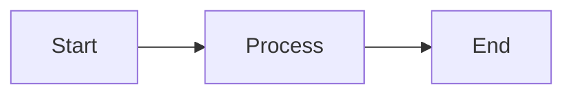

Before the code QA

```javascript
const total = [1, 2, 3].reduce((a, b) => a + b, 0);
console.log(total);
```


```mermaid
flowchart LR
  A[Start] --> B[Process]
  B --> C[End]
```

After the diagram QA
